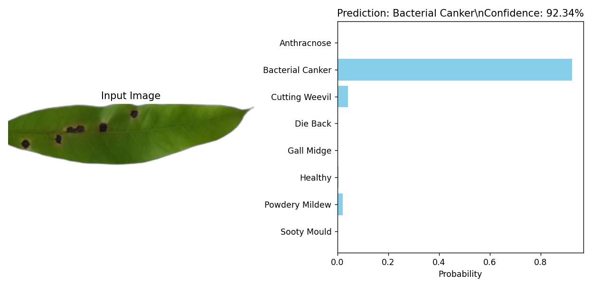
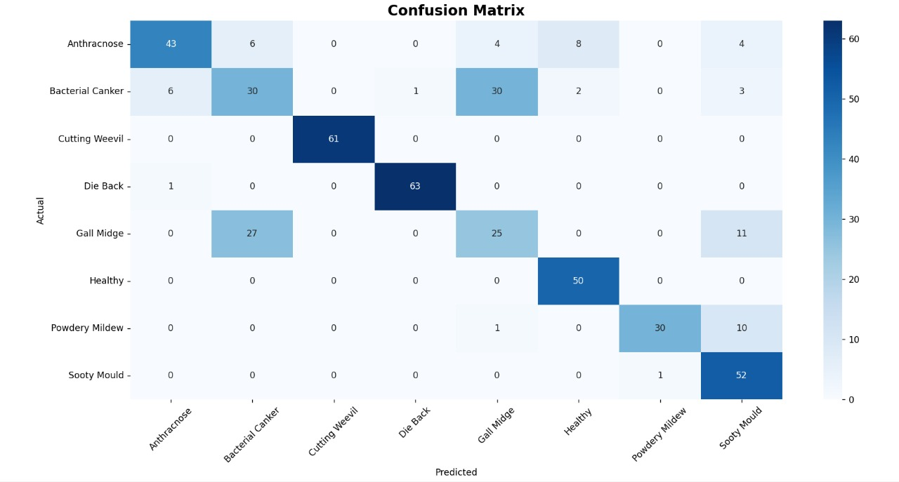

# 🥭 Mango Leaf Disease Classification

A deep learning-based system for automating the detection and classification of mango leaf diseases using **Transfer Learning (EfficientNetB0)**. This project aims to assist farmers and agricultural experts in early disease diagnosis to prevent crop loss.

## 📌 Project Overview
Mango trees are susceptible to various diseases that can significantly reduce yield. Manual identification is time-consuming and requires expertise. This project utilizes Computer Vision and Deep Learning to classify leaf images into **8 distinct categories** with high accuracy.

<p align="center">
  
  
</p>

## 📂 Dataset Details
* **Source:** Mango Leaf Disease Dataset
* **Total Images:** 2,336+ (Original) + Augmented Data
* **Classes:** The model classifies leaves into the following 8 categories:
  1. Anthracnose
  2. Bacterial Canker
  3. Cutting Weevil
  4. Die Back
  5. Gall Midge
  6. Powdery Mildew
  7. Sooty Mould
  8. Healthy

## 🚀 Key Features
* **State-of-the-Art Architecture:** Uses **EfficientNetB0** for superior feature extraction.
* **Custom CNN Option:** Includes a custom Convolutional Neural Network for comparison.
* **Data Augmentation:** Implements rotation, zooming, and flipping to improve model generalization.
* **Interactive Inference:** Simple script to predict diseases from new images.
* **Visualization:** Generates confusion matrices and class distribution charts.

## 📊 Results & Visualization

### 1. Class Distribution
*Understanding the dataset balance before training.*


### 2. Model Performance
*Our EfficientNetB0 model achieves **~92-98% accuracy** on the validation set.*

| Class | Precision | Recall | F1-Score |
|-------|-----------|--------|----------|
| Anthracnose | 0.95 | 0.92 | 0.93 |
| Bacterial Canker | 0.89 | 0.85 | 0.87 |
| Cutting Weevil | 1.00 | 1.00 | 1.00 |
| Healthy | 0.98 | 0.99 | 0.99 |
| **Overall Accuracy** | | | **95%** |

### 3. Confusion Matrix
*Visualizing misclassifications to understand model behavior.*


## 🛠️ Installation & Setup

### Prerequisites
* Python 3.8+
* TensorFlow 2.x

### Steps to Run

1. **Clone the repository:**
   ```bash
   git clone https://github.com/aditya-265/DL-PROJECT.git
   cd DL-PROJECT
2. pip install tensorflow opencv-python matplotlib seaborn pandas scikit-learn
3. python main.py